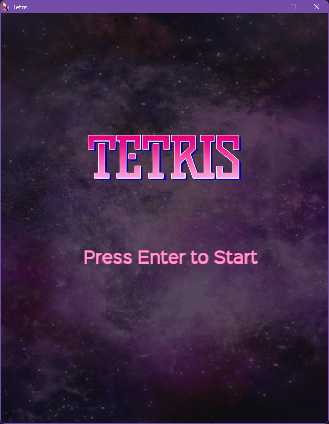
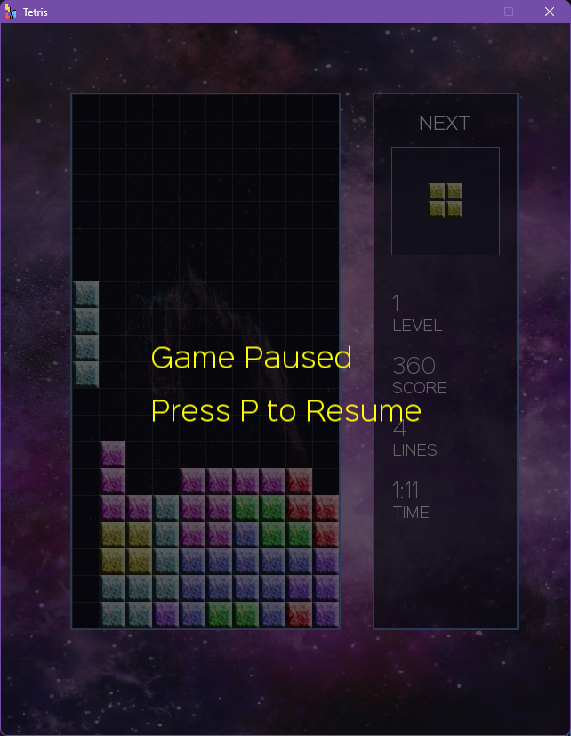
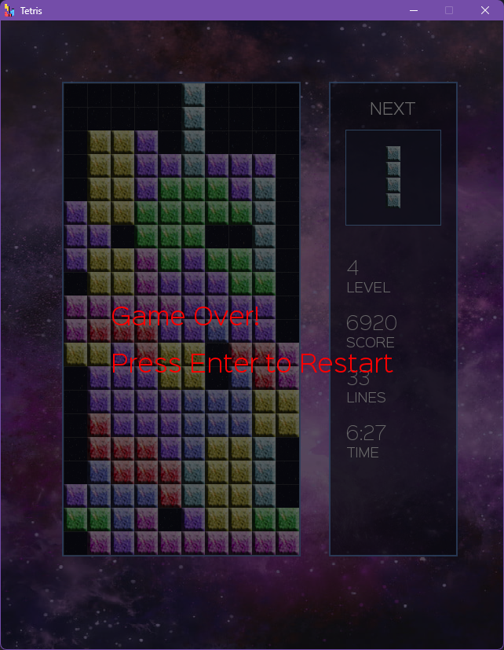

# Tetris-SFML

## Overview

This project is a C++ implementation of Tetris using the Simple and Fast Multimedia
Library ([SFML](https://www.sfml-dev.org)) for graphics,
input handling, and rendering. It replicates the core mechanics of the classic game, including tetromino movement,
rotation, collision detection, line clearing, and score progression. The project demonstrates the use of SFML
for game development, focusing on efficient rendering and real-time user interaction.

## Features

* 🎮 Classic Tetris Gameplay – Faithful mechanics with smooth and responsive controls.
* 🖼️ SFML-Powered Graphics – Clean rendering, fluid animations, and efficient performance.
* 🧮 Score Tracking – Points awarded for line clears, with bonuses for multiple clears at once.
* 📈 Level Progression – Increasing difficulty as levels advance with faster falling tetrominoes.
* 🔮 Next Piece Preview – Plan ahead by seeing the upcoming tetromino.
* ⚡ Game Over & Restart – Smooth reset functionality for quick replays.

## Screenshots

### Gameplay


### Game Entry



### Game Paused



### Game Over



## Game Controls

* ← / A – Move tetromino left
* → / D – Move tetromino right
* ↓ / S – Soft drop (increase falling speed)
* ↑ / W – Rotate tetromino clockwise
* Space – Hard drop (instantly place the piece at the bottom)
* P – Pause / Resume the game
* Esc – Quit the game

## Requirements

To run this project, you'll need:

* CMake ≥ 3.5
* C++20

## Getting Started

```bash
mkdir build && cd build
cmake ..
cmake --build .
./Tetris
```

## License

This project is released under the [MIT License](LICENSE).
